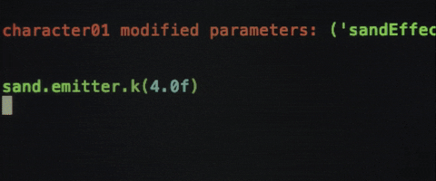

<h1 align="left">  </h1>
<h1 align="center">Hi there 👋</h1>
<h3 align="center"> I'm  A Cross Platform & Full Stack Developer, based in Paris</h3>

  I'm a passionate Full-Stack Developer who loves building end-to-end applications with modern technologies. From designing sleek front-end interfaces to building scalable back-end systems, I enjoy the entire process of creating powerful software.

⚡I am currently working on my own webpage https://www.djangofullstack.com
>
👯 I'm always open to collaborating with companies in a constructive, innovative way to drive projects forward, deliver high-quality solutions, and contribute to meaningful growth.

<h1 align="center"> </h1>
<h1 align="center"> </h1>

<h1 align="center"> 💻 Tech Stack</h1>

                           

<h1 align="center"> </h1>
 <h1 align="center">✍️ Dev Quote</h1>

<h1 align="center"> </h1>

<picture>
  <source media="(prefers-color-scheme: dark)" srcset="https://raw.githubusercontent.com/tobiasmeyhoefer/tobiasmeyhoefer/output/github-snake-dark.svg" />
  <source media="(prefers-color-scheme: light)" srcset="https://raw.githubusercontent.com/tobiasmeyhoefer/tobiasmeyhoefer/output/github-snake.svg" />
  
</picture>

